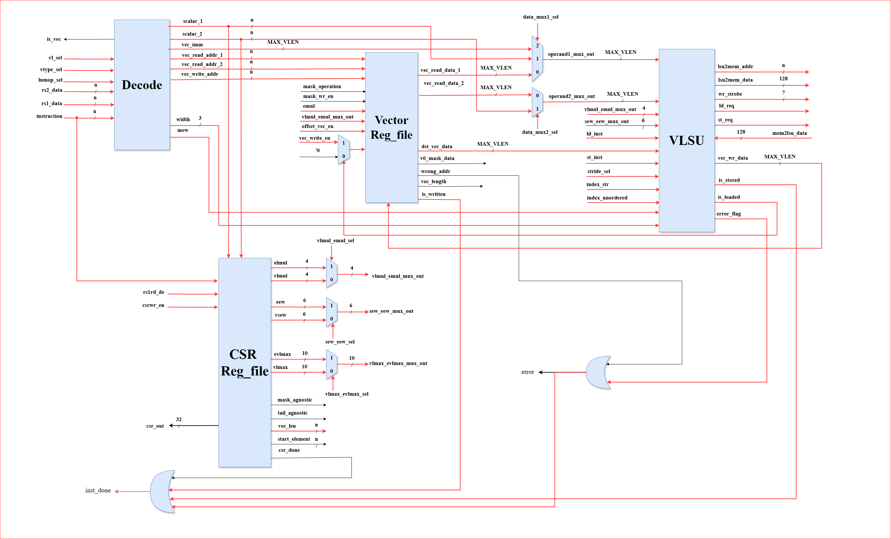

# Vector Co-Processor

## Description

This repository presents a fully functional **Vector Load/Store Unit (VLSU)** that integrates with a scalar processor to handle memory-intensive vector operations. Designed to be **educational**, **modular**, and **scalable**, it serves as a practical introduction to vector processing for learners and researchers alike.


## System Architecture

### Top-Level Block Diagram

The block diagram below illustrates the interaction between the Scalar Processor, Vector Co-Processor, and Memory. Instructions are issued by the scalar core and executed via the VLSU, with memory transactions handled accordingly.


> The `vec_pro_ready`, `vec_pro_ack`, and `scalar_pro_ready` signals manage synchronization and handshake logic.

---

# Vector Processor Datapath

This repository contains the datapath design of a vector processor architecture. The datapath illustrates the internal communication between key functional units and how vector instructions are executed in conjunction with scalar and control status register (CSR) components.



---

## Datapath Overview

The datapath consists of the following main components:

### 1. **Decode Unit**
- Decodes vector instructions into control and data signals.
- Outputs addresses and enables for reading/writing vector registers.
- Interfaces directly with the Vector Register File and CSR unit.

### 2. **Vector Register File**
- Stores vector operands.
- Supports reading and writing of vector elements up to `MAX_VLEN`.
- Handles masked operations and writes.

### 3. **CSR (Control and Status Register) File**
- Stores runtime configuration such as:
  - `VLEN`: Maximum vector length.
  - `LMUL`: Vector length multiplier.
  - `vstart`, `vlen`, `vl`, `vtype`: Other vector-related control parameters.
- Controls masking and tail settings.
- Interfaces with both the decode unit and VLSU.

### 4. **VLSU (Vector Load Store Unit)**
- Handles memory operations for vector elements.
- Supports:
  - **Unit-stride** access
  - **Strided** access
  - **Indexed** access
- Outputs vector memory data for writing back to registers.

---

## Features Highlighted in Datapath

- **Flexible memory access patterns** via the VLSU.
- **Masked operations** with runtime control from CSR.
- **Dynamic configuration** through CSR programming for varying vector lengths.
- **Efficient operand muxing and data routing** among units.

---


## Simulation Waves

The waveform below shows a successful sequence of vector load/store operations using ModelSim/Vivado. Key activities include valid instruction decoding, data loading, address generation, and memory interaction.


> **Highlights:**
- Observe valid vector instructions like `V LOAD`, `V STORE`.
- Monitor address calculations, handshaking, and memory alignment.
- Verify expected opcode and func3 decoding (`0x07` for VLOAD).

---

## Verification Environment

Our verification infrastructure validates DUT behavior through real-time comparisons between expected and actual results. The Monitor module captures internal signal transitions and flags inconsistencies.


> Features:
- Built-in **golden model monitor**
- Custom testbench with instruction/memory logs
- End-to-end testing with result matching

---

## Results Snapshots

Representative results include:
- Instruction execution
- Intermediate registers
- Final memory values compared with the monitor

*Images:*


## Configuration Errors

Built-in error detection helps debug:
- Misaligned base addresses
- Invalid LMUL/VLEN or mask configurations
- AXI protocol errors


> On detecting errors, flags are raised and logs are printed for debugging.

---

## Makefile Testing

A `Makefile` is provided for compilation, elaboration, simulation, and waveform viewing using both **Vivado (XSim)** and **ModelSim**. Below are the available commands and what to expect from each.

---

## Vivado (XSim) Workflow

Vivado/XSim is used for SystemVerilog simulation and waveform analysis.

### Available Commands

- `make vivado`  
  Run the full Vivado flow: **compile → elaborate → simulate**

- `make viv_compile`  
  Compile only the SystemVerilog sources with `xvlog`.

- `make viv_elaborate`  
  Elaborate the design using `xelab`.

- `make viv_waves`  
  Launch the waveform viewer with `xsim --gui`.

---

## ModelSim Workflow

ModelSim is available as an alternative simulator for supported environments.

### Available Commands

- `make vsim`  
  Executes the full ModelSim flow:
  - Creates a `work` library
  - Compiles all SystemVerilog sources
  - Runs the simulation with waveforms

---

## Clean Up

To remove all simulation artifacts and reset the environment:

```bash
make clean
```

---

## 📊 Simulation Output Reference

| **Test Type**      | **Result (Vivado / ModelSim)** |
|--------------------|-------------------------------|
| Load Only          | Load complete              |
| Load/Store (Pass)  | Load/Store test pass       |
| Load/Store (Fail)  | Load/Store test fail       |
| CSR Config Only    | Test pass                  |

---

## Source Structure

- SystemVerilog Sources: `src/*.sv`
- Testbench: `test/vector_processor_tb.sv`
- Defines: `define/*.svh`

---

## Requirements

- **Vivado** (for XSim): Tested with Vivado 2020.2+
- **ModelSim** (optional): For alternative simulation
- **GNU Make**: For running simulation targets

---

## Contribution Guidelines

We welcome contributions!  
Please refer to our [Contribution Rubrics](./CONTRIBUTING.md) before submitting PRs or issues.

---

## Authors

- **Fazail Ali Butt** (2021-EE-142)  
- **Shanzay Wasim** (2021-EE-154)  
- **Zawaher Bin Asim** (2021-EE-163)  
- **Muhammad Bilal Matloob** (2021-EE-171)  

**Supervisor:** Dr. Ubaid Ullah Fiaz  
Department of Electrical Engineering, UET Lahore

---

